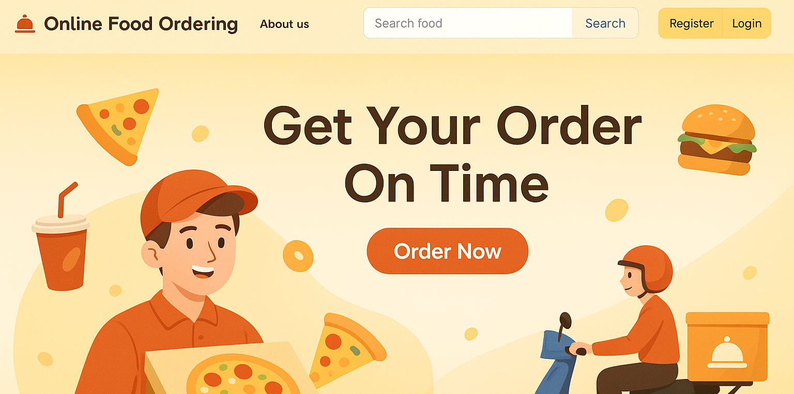

# mini-swiggy

🍕 Online Food Ordering Website
An interactive and responsive online food ordering platform built using Spring Boot (Java) for backend services and HTML, CSS, JavaScript for the frontend. This project provides a seamless experience for customers to browse food items, search, and place their orders online.

🚀 Features
Modern and user-friendly web interface

Responsive design for desktop and mobile

Food item search functionality

User registration and login

Order placement and tracking

Backend APIs built using Spring Boot

Project managed using Maven

🛠 Technologies Used
Frontend: HTML5, CSS3, JavaScript

Backend: Java, Spring Boot

Build Tool: Maven

Database: (Add your DB here, e.g., MySQL or H2 if you are using)

📦 Project Setup Instructions
Clone the repository

git clone https://github.com/lavanya-ankisetty/mini-swiggy.git
cd mini-swiggy

Backend Setup

Import the project into your favorite IDE (like IntelliJ IDEA, Eclipse).

Make sure Maven is installed.

Configure application properties (src/main/resources/application.properties).

Run the Spring Boot Application:

mvn spring-boot:run
Frontend Setup

Frontend files are available inside src/main/resources/static/.

Customize HTML/CSS/JS as per your needs.

Access the application

Navigate to: http://localhost:8080

Home Page

Food Search

Login/Register

🤝 Contributing
Contributions are welcome!
Please fork this repository and submit a pull request for any enhancements or bug fixes.

📄 License
This project is open-source and available under the MIT License.

🙋‍♂️ Author
Lavanya Ankisetty

LinkedIn: https://in.linkedin.com/in/lavanya-ankisetty-0587b1351

GitHub: lavanya-ankisetty

Note: -- I've attached only java files here,
If you require full project please reach out me at lavanya.ankisetty@gmail.com
